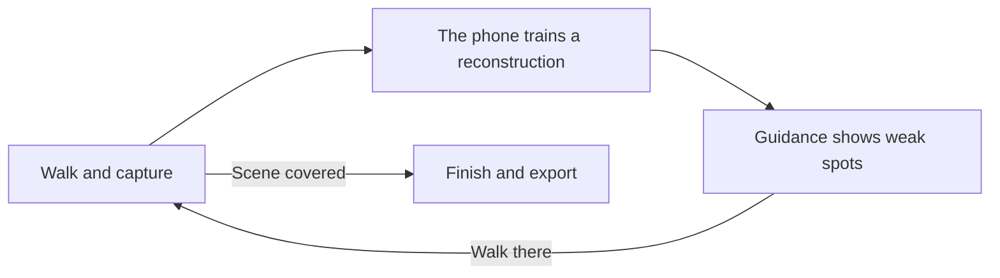

# Capture Guide

Capture Guide is an iPhone app for recording a scene, such as a room or an outdoor area, for 3D Gaussian Splatting (a way of turning photos into a 3D model you can view from any angle). While you walk, the phone trains a rough reconstruction from the frames it has taken so far and marks the places that are still weak. You see those marks in AR and walk there before you leave the scene.

Every capture is also saved as a posed dataset (the photos plus where the camera was for each one), ready for the training software of your choice.

{ loading=lazy }
/// caption
Clip pending: guidance in AR
///

## Where to go next

- [Getting started](getting-started.md): what you need, and your first capture.
- [Capturing a scene](capturing.md): how to walk through a scene and which frames the app skips.
- [Reading the guidance](guidance.md): what the coloured dots and the yellow camera tell you.
- [Exporting](exporting.md): getting a capture off the phone and training it.
- [Troubleshooting and FAQ](troubleshooting.md): what to do when tracking is lost or the phone runs hot, and what the error messages mean.
